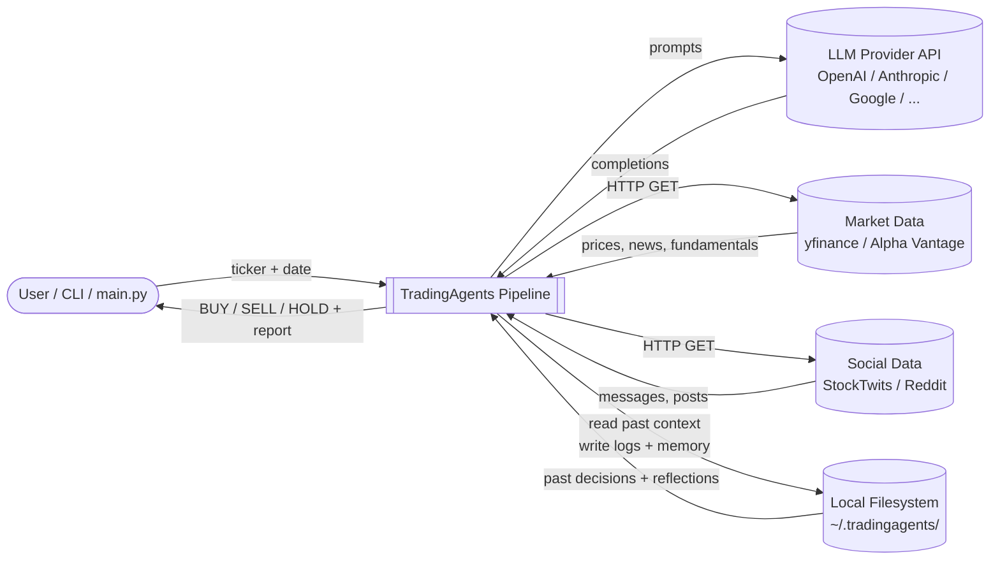
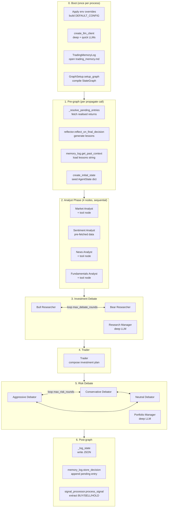

# TradingAgents — End-to-End Data Flow

This document explains how a single `propagate(ticker, date)` call moves data through the system, without the multi-agent framing. The pipeline is a sequence of Python function calls; LangGraph is just the dispatcher that decides which function runs next.

---

## 1. Big Picture (DFD Level 0)

A context-level view: one external caller, one system, three external data services, one LLM service, and the local filesystem.



**Inputs:** `ticker` (e.g. `"NVDA"`), `trade_date` (`"YYYY-MM-DD"`), `asset_type` (`"stock"` or `"crypto"`).
**Outputs:** a `final_state` dict (all intermediate reports + final decision text) and a normalised signal string (`"BUY"`, `"SELL"`, `"HOLD"`).
**Side effects:** a JSON state log on disk, a markdown entry in the memory log.

---

## 2. Pipeline Stages (DFD Level 1)

Zooming into the system, work is grouped into six sequential stages. Data flows top-to-bottom; stage outputs feed the next stage's inputs.



---

## 3. Function-to-Function Trace

The actual call sequence when you run `ta.propagate("NVDA", "2026-01-15")`.

### Stage 0 — Boot (one-time, in `TradingAgentsGraph.__init__`)

| # | Function | File | Purpose |
|---|---|---|---|
| 1 | `_apply_env_overrides(config)` | [default_config.py](tradingagents/default_config.py) | Merge `TRADINGAGENTS_*` env vars into `DEFAULT_CONFIG` |
| 2 | `set_config(config)` | [dataflows/config.py](tradingagents/dataflows/config.py) | Publish config globally for data-vendor functions |
| 3 | `create_llm_client(provider, model, ...)` ×2 | [llm_clients/factory.py](tradingagents/llm_clients/factory.py) | Build `deep_thinking_llm` and `quick_thinking_llm` |
| 4 | `TradingMemoryLog(config)` | [agents/utils/memory.py](tradingagents/agents/utils/memory.py) | Open the persistent decision log |
| 5 | `_create_tool_nodes()` | [graph/trading_graph.py:158](tradingagents/graph/trading_graph.py#L158) | Pack 9 data-fetching tools into 4 `ToolNode` groups |
| 6 | `GraphSetup.setup_graph(...)` | [graph/setup.py](tradingagents/graph/setup.py) | Build the `StateGraph`, add nodes and edges |
| 7 | `workflow.compile()` | langgraph | Return the executable graph |

### Stage 1 — Pre-graph (in `propagate(...)`)

| # | Function | What runs |
|---|---|---|
| 8 | `_resolve_pending_entries(ticker)` | For each prior pending run: `yf.Ticker(ticker).history(...)` + benchmark history, compute raw + alpha return |
| 9 | `reflector.reflect_on_final_decision(...)` | One LLM call per pending entry → lesson paragraph |
| 10 | `memory_log.batch_update_with_outcomes(updates)` | Rewrite `trading_memory.md` atomically |
| 11 | `get_checkpointer(...)` (if `checkpoint_enabled`) | Open per-ticker SQLite saver, recompile graph |
| 12 | `memory_log.get_past_context(ticker)` | Load condensed lessons string |
| 13 | `propagator.create_initial_state(...)` | Build `AgentState` dict with empty report fields |
| 14 | `self.graph.invoke(init_state, ...)` | Hand control to LangGraph |

### Stage 2 — Analyst phase (executed by LangGraph)

For each analyst (market → social → news → fundamentals):

```
analyst_node(state)
  └─ build prompt, llm.bind_tools([...]), invoke
  └─ result has tool_calls?  ──yes──▶ tool_node executes tool fns,
                                     appends ToolMessage, loop back
                             ──no───▶ write report to state, clear messages
```

Per-analyst tool calls:

| Analyst | Tools called | Underlying data fetch |
|---|---|---|
| Market | `get_stock_data`, `get_indicators` | `yf.Ticker(...).history(...)`, then `stockstats` for MACD/RSI/BB |
| Sentiment | (none — pre-fetched) | `get_news.func(...)`, `fetch_stocktwits_messages(...)`, `fetch_reddit_posts(...)` |
| News | `get_news`, `get_global_news`, `get_insider_transactions` | `yf.Ticker(...).get_news()`, `yf.Search(query).news`, `yf.Ticker(...).insider_transactions` |
| Fundamentals | `get_fundamentals`, `get_balance_sheet`, `get_cashflow`, `get_income_statement` | `yf.Ticker(...).info / .balance_sheet / .cashflow / .income_stmt` |

State outputs: `market_report`, `sentiment_report`, `news_report`, `fundamentals_report`.

### Stage 3 — Investment debate

| # | Function | LLM | Writes to state |
|---|---|---|---|
| 15 | `bull_researcher_node(state)` | quick | `investment_debate_state.bull_history` |
| 16 | `should_continue_debate(state)` | — | Route to Bear or Research Manager |
| 17 | `bear_researcher_node(state)` | quick | `investment_debate_state.bear_history` |
| 18 | (loop until `max_debate_rounds × 2` turns) | | |
| 19 | `research_manager_node(state)` | **deep** | `investment_plan` (structured) |

### Stage 4 — Trader

| # | Function | LLM | Writes to state |
|---|---|---|---|
| 20 | `trader_node(state)` | quick | `trader_investment_plan` |

### Stage 5 — Risk debate + final decision

| # | Function | LLM | Writes to state |
|---|---|---|---|
| 21 | `aggressive_debator(state)` | quick | `risk_debate_state.aggressive_history` |
| 22 | `conservative_debator(state)` | quick | `risk_debate_state.conservative_history` |
| 23 | `neutral_debator(state)` | quick | `risk_debate_state.neutral_history` |
| 24 | (loop until `max_risk_discuss_rounds × 3` turns) | | |
| 25 | `portfolio_manager_node(state)` | **deep** | `final_trade_decision` (structured) |

### Stage 6 — Post-graph (back in `_run_graph`)

| # | Function | Effect |
|---|---|---|
| 26 | `_log_state(trade_date, final_state)` | Write `~/.tradingagents/logs/<TICKER>/.../full_states_log_<date>.json` |
| 27 | `memory_log.store_decision(...)` | Append pending entry to `trading_memory.md` |
| 28 | `clear_checkpoint(...)` (if enabled) | Delete SQLite row for this run |
| 29 | `signal_processor.process_signal(...)` | One LLM call → `"BUY"` / `"SELL"` / `"HOLD"` |
| 30 | `return (final_state, signal)` | Hand result back to caller |

---

## 4. Data Stores

| Store | Path | Format | Written by | Read by |
|---|---|---|---|---|
| Results log | `~/.tradingagents/logs/<TICKER>/TradingAgentsStrategy_logs/full_states_log_<date>.json` | JSON | `_log_state` | (external / inspection) |
| Decision memory | `~/.tradingagents/memory/trading_memory.md` | Markdown | `store_decision`, `batch_update_with_outcomes` | `get_past_context`, next-run reflection |
| Cache / checkpoints | `~/.tradingagents/cache/checkpoints/<TICKER>.db` | SQLite | LangGraph `SqliteSaver` | resume on next run |
| Data cache | `~/.tradingagents/cache/...` | various | data-vendor modules | data-vendor modules |

Paths are overridable via `TRADINGAGENTS_RESULTS_DIR`, `TRADINGAGENTS_CACHE_DIR`, `TRADINGAGENTS_MEMORY_LOG_PATH`.

---

## 5. External Calls Per Run (defaults)

| External service | Calls | Auth |
|---|---|---|
| yfinance / Yahoo HTTP | ~4–10 (prices, news, search, financials, insider, benchmark) | None |
| stocktwits.com | 1 | None |
| reddit.com | 3 (one per subreddit) | None |
| LLM provider (`quick_llm`) | ~15–25 (analyst loops + debates + risk + signal) | API key |
| LLM provider (`deep_llm`) | 2 (Research Manager + Portfolio Manager) | API key |
| Filesystem | 1 JSON write + 1 markdown append | — |

Numbers scale with `max_debate_rounds` and `max_risk_discuss_rounds`.

---

## 6. Where to Look in the Code

- Entry point: [main.py](main.py)
- Orchestrator: [tradingagents/graph/trading_graph.py](tradingagents/graph/trading_graph.py)
- Graph topology: [tradingagents/graph/setup.py](tradingagents/graph/setup.py)
- Routing logic: [tradingagents/graph/conditional_logic.py](tradingagents/graph/conditional_logic.py)
- State schema: [tradingagents/agents/utils/agent_states.py](tradingagents/agents/utils/agent_states.py)
- Tool functions: [tradingagents/agents/utils/](tradingagents/agents/utils/)
- Data vendors: [tradingagents/dataflows/](tradingagents/dataflows/)
- LLM clients: [tradingagents/llm_clients/](tradingagents/llm_clients/)
- Configuration: [tradingagents/default_config.py](tradingagents/default_config.py)
